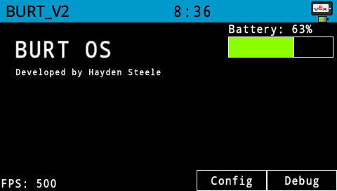
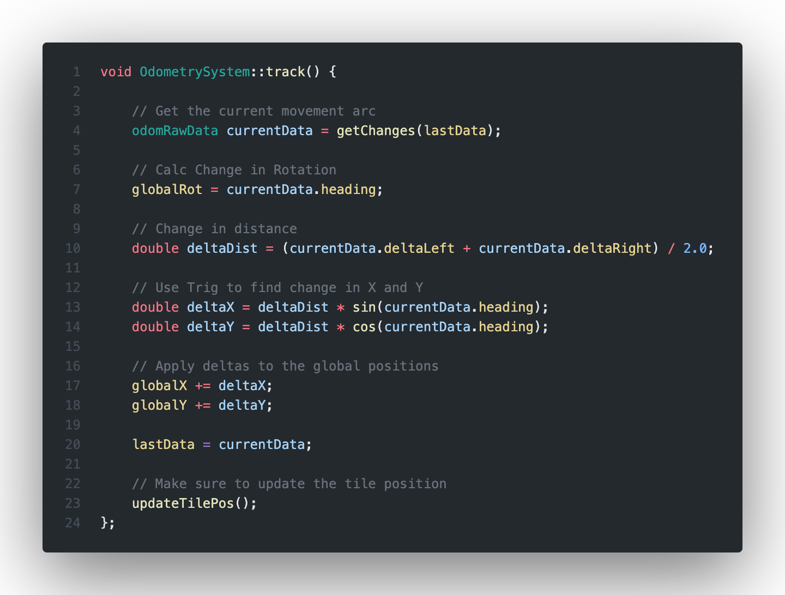
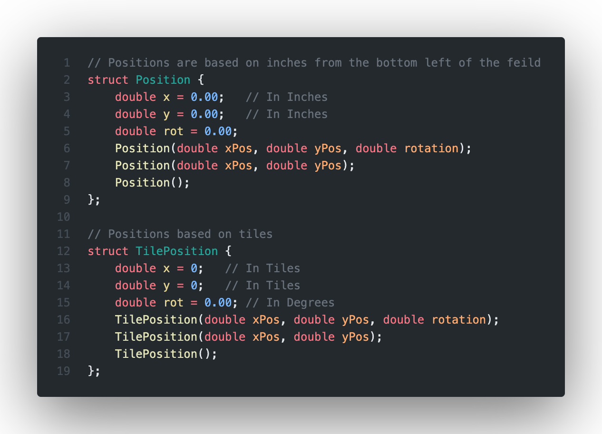

# BURT_V2 

 

## Pros to C++ Switch TODO
- [ ] Change wings to State Machine
  - [X] Refactor State Machine Class for C++ 
  - [X] Add wing motors
  - [X] Change wings over to state machine
  - [X] Redo Auton Functions
  - [X] Redo Auton Logic ( Catapult Logic, Wing Logic )
- [ ] Simplify Auton Selector System
- [X] Have Auton Verification sent to controller
- [X] Implement new controller layout
- [X] Maybe switch catapult to flywheel system ( Regardless, use state machine )

 

[BURT Path Builder](https://github.com/ChickenNuggetsPerson/BURT_V2_Path_Visualizer)

The code for team 84075A in the Over Under game ( 2023 - 2024 )

"Since the 2022 - 2023 game year was my first year programming in C++, I am slowly learning how to do this so please don't judge my lack of industry standards when programming 😐" - Hayden

# Main Features:

## AUTON:

One of the main features of Burt for this year was to develop a reliable autonomous system that is easy to configure.

In order to achive this goal, a reliable position tracking system is required. Sole reliance on using primative functions such as `driveFwd(double dist)` or `turn(double deg)` would provide a simple but unreliable autonoumous path. Motors fluctuate in power, game elements are not in exact spots, and sensors can drift. All of these can cause a hardcoded autonomous path to fail.

## Odometry:

    Definition: Odometry is the use of data from motion sensors to estimate change in position over time. (Wikipedia)

Through a very tedious process of tweaking and rewriting code, a reliable odomotry system was developed. By using onboard sensors, Burt is able to track his change in position over time and use that in his autonomous.

Using fairly simple trigonometry, data such as chagne in angle and distance can be used to determine the change in postion on the global cordinate system.

### ODOM Structs:

Having a consistent data structure for storing positions is required for keeping code consise. Through that, Burt has two position structs. `Postion` and `TilePosition`. Every autonomous fucntion that takes in a position can take in both of these structs.

TODO: Finish This