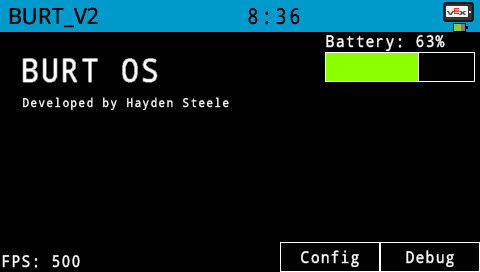
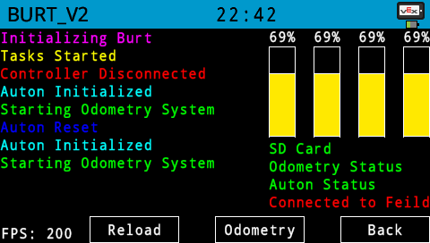
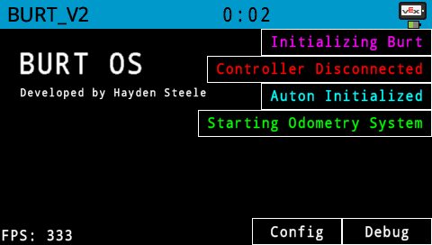
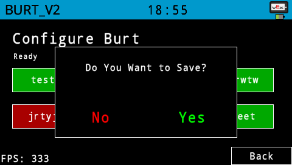
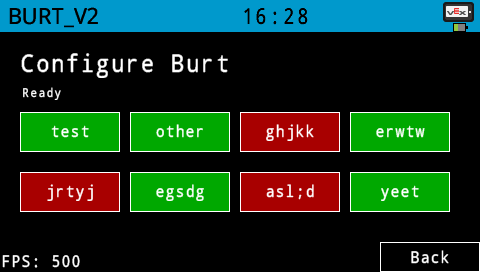
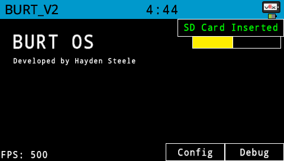

# BURT_V2 

 

The code for team 84075A in the Over Under game ( 2023 - 2024 )

"Since the 2022 - 2023 game year was my first year programming in C++, I am slowly learning how to do this so please don't judge my lack of industry standards when programming 😐" - Hayden

# Framework Features:

## Brain Displayer:

### Menu System:
Everything is rendered through the `MenuSystem` class. Add pages to the object and they will be rendered to the screen using the `MenuSystem::render()` function. 

Pages can be added using: 
`MenuSystem::addPage(const char* pageId, Page* page)` 
and you can go to a page using: 
`MenuSystem::gotoPage(const char* pageId)`
  
Outside of the displayer.cpp file, you can use the following functions to edit data and change pages: 
`brainChangePage();` 
`brainPageChangeData();` 
`brainPageChangeText();`

The Menu System also automatically handles starting and stopping update tasks ( see bellow ).

### Pages:

The display system is easily editable to show any information needed on the brain screen. Currently it can show information in three formats; progress bars, line graphs, or simple text. The `Page` class is used for building individual pages. Once declared, the different graph types can be added to the page and their values can be updated. Each graph has an Id assigned to it. 

`.addHorzProgressBar(barId, x, y, width, height, name, middle, ranges[]);`
    
 `.addVertProgressBar(barId, x, y, width, height, name, middle, ranges[]);`
    
 `.addLineGraph(graphId, graphType, graphName, xPos, yPos, graphWidth, graphHeight, drawMiddle, colorRanges[], maxDataPoints)`

`.addText(text, x, y, displayColor, id)`

Once created, data can be changed using: 
`.setProgressBarValue()` 
`.setLineGraphValue()`  
`.setTextData()`

### Continuously Updating Data:
 
 Page data can be continually updated using the `.addDataUpdaterCB()` function. First, declare your update function as follows:

    int updateDebug(Page* self) {
    
	    return  1;
    }
    
When run, the update function is given the pointer to the page object. This means that any aspect of the page object can be edited through this update function. In this example, we are setting the progressbars on the page to the temperature of the four different motors.

	int updateDebug(Page* self) {
		
	    self->setProgressBarValue("fl", leftMotorA.temperature(fahrenheit));
	    self->setProgressBarValue("fr", rightMotorA.temperature(fahrenheit));
	    self->setProgressBarValue("bl", leftMotorB.temperature(fahrenheit));
	    self->setProgressBarValue("br", rightMotorB.temperature(fahrenheit));
		
	    return 1;
	}

Once the update function is defined, it is added using the `.addDataUpdaterCB()` function on the page. ( You can also define the time between updates in seconds )

	debugPage.addDataUpdaterCB(updateDebug, 1); // Update the page every second

This is the debug page. It shows the [logs](https://github.com/ChickenNuggetsPerson/BURT_V2#log-messages) on the left, the motor temperatures on the right, and the status of various tasks on the bottom right. It also has navigation [buttons](https://github.com/ChickenNuggetsPerson/BURT_V2#interactables) on the bottom that allow for switching between pages.

### Log Messages:
The logging system is controlled by the `Logger` object. When creating a logger, it is given the row and column that it is drawn at. The Logger then can be added to a `Page` by using the `.addLogger()` method.

    homePage.addLogger(&BrainLogs); // Add the pointer to the logger to the page

By default, the Logger object is not extended to the rest of the program so use the following functions to send messages to the brain screen from anywhere else in the program.

    void brainError(const char* message); // Send with error color
    void brainDebug(const char* message); // Send with debug color
    void brainFancyDebug(const char* message, vex::color messageColor); // Send with custom color
    void brainFancyDebug(const char* message, vex::color messageColor, int data); // Send some data with the message ( use %d )

Logs are automatically saved to the "logs.txt" on the SD Card.

### Notifications:

On the topic of the Logging System, there is annother way to show information to the user. The `MenuSystem` has a way of also displaying notifications to the user using:

    MenuSystem::newNotification(const char* text, int displayTime, vex::color displayColor);

Some notes on notifications...

1. Only 5 can display at a time
2. They display in the top right of the screen
3. The `brainError()` function automatically also sends as a notification
4. If you add a `true` as the last argument of `brainFancyDebug()` it will send as a notification

Here is the Home Screen with notifications on the top right:

### Interactables:
Currently there are two* types of interactable objects: buttons and toggles. The main difference between a button and a toggle is what happens when they are pressed. When pressed, buttons will call the callback specified when they are created. When a toggle is pressed, no callback is called but the state of the toggle is changed. The state of the toggle is displayed as the fill color of the toggle. 

To add a toggle to a page, use:

    Page::addToggle( const char* displayText, bool startStatus, vex::color offColor, vex::color onColor, int x, int y, int width, int height);

To add a button, use:

    Page::addButton(const char* text, int x, int y, int width, int height, int (*cb)(Page*), const char* id = "", vex::color fillColor);

The most common use of the button object is used to change the current page. Since every page stores the pointer to the `MenuSystem` controlling it, buttons can directly change the current displayed page. Here is an example button callback that goes to the main page. 

    int gotoMainPageButton(Page* self) {
        self->menuSystemPointer->gotoPage("main");
        return 1;
    };

For toggles, their value can be fetched or altered using:

    Page::getToggleStatus(const char* toggleId); // Returns a bool
    Page::setToggleStatus(const char* toggleId, bool status);

### ✨ Overlays ✨

So there is another element that is technically an interactable but does not work the same as buttons or toggles. Introducing... Overlays. 

Overlays are temporary elements that can be called anywhere in the code as long as there is access to the current Page being displayed. The most common use of this is used in button callbacks (Since button callbacks already have access to the page object). Overlays are primarily used to ask the user to choose between two options. ( Most of the time, yes or no)

To create an overlay, you first need to make an `OverlayQuestion`

Then you can edit the different values of the object to define the overlay. Here is the definition for the `OverlayQuestion` object:

    struct OverlayQuestion {
        const char* question;    
        const char* option1;
        vex::color option1Color = white;    
        const char* option2;
        vex::color option2Color = white;
    };

Once the overlay is defined, pass it into:

    Page::overlayQuestion(OverlayQuestion overlay);

The interesting thing about overlays is that they are purley temporary. `overlayQuestion` returns a bool based on the value chosen. False for option 1 and true for option 2. Since overlays are synchronous, that means that the thread runnign the overlay will wait until the user choose the option. This allows the fucntion to be directly run in an `if ()` statement. 

Here is an example of asking the user if they want to save when they press the exit button.

    int exitButton(Page* self) {
      
        OverlayQuestion confirmOverlay;
        confirmOverlay.question = "Do You Want to Save?";
        confirmOverlay.option1 = "No";
        confirmOverlay.option1Color = red;
        confirmOverlay.option2 = "Yes";
        confirmOverlay.option2Color = green;
    
        if (self->overlayQuestion(confirmOverlay)) {
                // Option 2

                // Save Code

                self->menuSystemPointer->gotoPage("main");
        } else {
                // Option 1

                // Don't save

                self->menuSystemPointer->gotoPage("main");
         }
        return 1;
    };

### Color Gradients:

For all display elements, they can be colored using a color gradient. All color gradients are comprised of an array of `colorRange` objects. ColorRanges are comprised of a min, max, and color. When drawing, the drawer checks if the value is in that range and if it is, it will draw it with that color. Color Ranges can either be "blocky" or "smooth". 

"Blocky" gradients are manually created by the user defining their own array of colorRanges:

    colorRange  myColorRange[4] = { // Make sure to make the array 1 bigger than the amount of colors
	    colorRange(0, 60, green),
	    colorRange(61, 80, yellow),
	    colorRange(81, 100, red),
    };

Or they can be created using the `Gradient` object to make a smooth transition. Gradients can be made with either RGB values using the `rgbColor` object or HSV values.

    Gradient(double startHue, double endHue, int startOfRange, int endOfRange)

    Gradient(rgbColor startColor, rgbColor endColor, int startOfRange, int endOfRange)

Example:

    Gradient myGradient = Gradient(10, 300, 10, 100);
    Gradient myOtherGradient = Gradient(rgbColor("red"), rgbColor(237, 212, 252), 0, 100);
Once created, pass the `.finalGradient` of the gradient to the function of choice.

Using it in a horizontal progress bar: 
`homePage.addHorzProgressBar("battery", 325, 15, 150, 30, "Battery: %d%%", false, batteryGradient.finalGradient);`

### Remove data from pages?
I do plan on adding the ability to remove items from pages. The problem is that everything is stored in arrays for the pages. This means that removing an item on the page can be a pain. I do plan on experimenting with a data structure called Linked Lists. Using Linked Lists would allow for more easy data manipulation but it will take a bit to implement since it is something that is not as standard as arrays.

## Auton + Odometry

Everything here is very vauge because we do not know what the new game is yet. Though I do want to invest a lot of time over the summer in a solid odometry and auton system. Purdue Sigbots has a lot of good information on their website: https://wiki.purduesigbots.com/software/odometry

## Easy PID Creation

One important part of any antonomous movement is the use of PIDs. In order to make the creation of PIDs easy, I made a PID class. When the PID is created, a PIDConfig is passed into the constructor along with the target value. Example:

    PID turnPID(PIDConfig(0.15, 0.001, 0.4), 90); // Set the target to 90 degrees

Then in the movement loop, run `.iterate()` and it will return the result value from the PID. Make sure to also pass in the current value. Here is an example loop using the PID:

    while (true) {
        
        heading = odometrySystemPointer->currentPos().rot;
        double power = turnPID.iterate(heading);

        LeftDriveSmart.spin(fwd, -power, volt);
        RightDriveSmart.spin(fwd, power, volt);
    
        wait(0.05, seconds);
    }

# Specific Burt Features

## Dynamically Generated Config Screen

Since there is no way of knowing what about the robot will need to be configured, the config screen is auto generated when the program is run. The init function reads the `Auton Class` for all of its configs and auto populates the config page with the corresponding toggles.

## Notification Watch System

As of writing this, the brain only looks for changes in two values:

1. SD Card Status
2. Inertial Sensor Calibration Status

I plan on expanding this list in the future

# Future Ideas / Plans

## Path Planning and Odometry

One pit fall of last year's robot was the lack of propper odometry and path planning. For a good chunk of last year, Burt had a path recording and replaying system. While it worked for smaller paths, the longer the path, the more off it was when replaying. This was because we had no sensors to work with. 

Midway through the 2022-2023 season, we got access to the Inertial sensor. After that, we migrated to a step by step solution. Drive 4 inches, turn right, drive 8 inches, etc. While the inertial sensor allowed for accurate turning, driving accurate distances was still a problem. The robot could run into a disk and then the whole path would be messed up. While our "janky" intake system could have caused some problems, the lack of error correction in the auton drive functions definetly cuased problems for long disntance driving. 

This year, I plan on integrating at least two tracking wheels. Into the odometry system along with the inertial sensor. 

Another plan for this year is the plan for automated path planning. Instead of saying "drive 4 inches, turn right", I would like to have a system where I could say "goto ( 2, 4 ) on the feild". This would require a system that could constantly track the position of the robot on the feild. It would also require some sort of path finding system too. This is why I am starting the code for BURT_V2 this early, so then I can do propper research and testing on odometry systems and path planning. 

